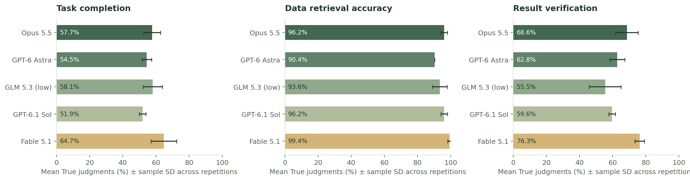
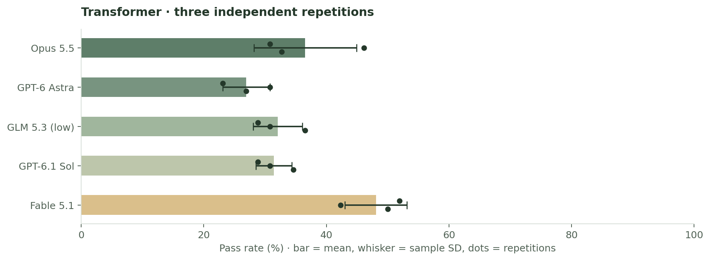
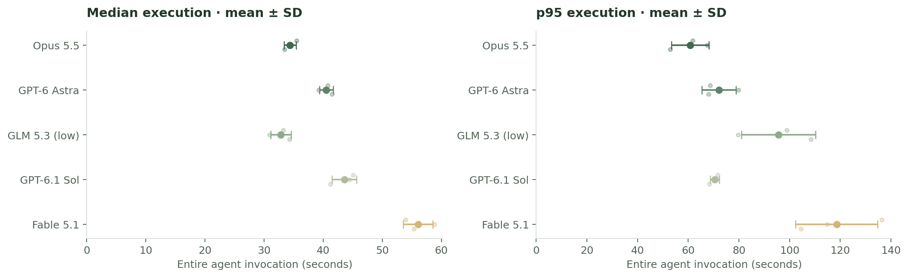
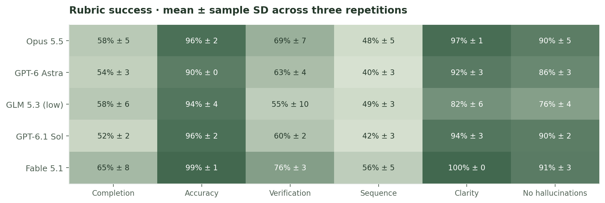
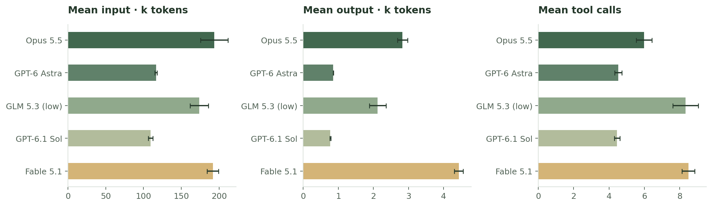
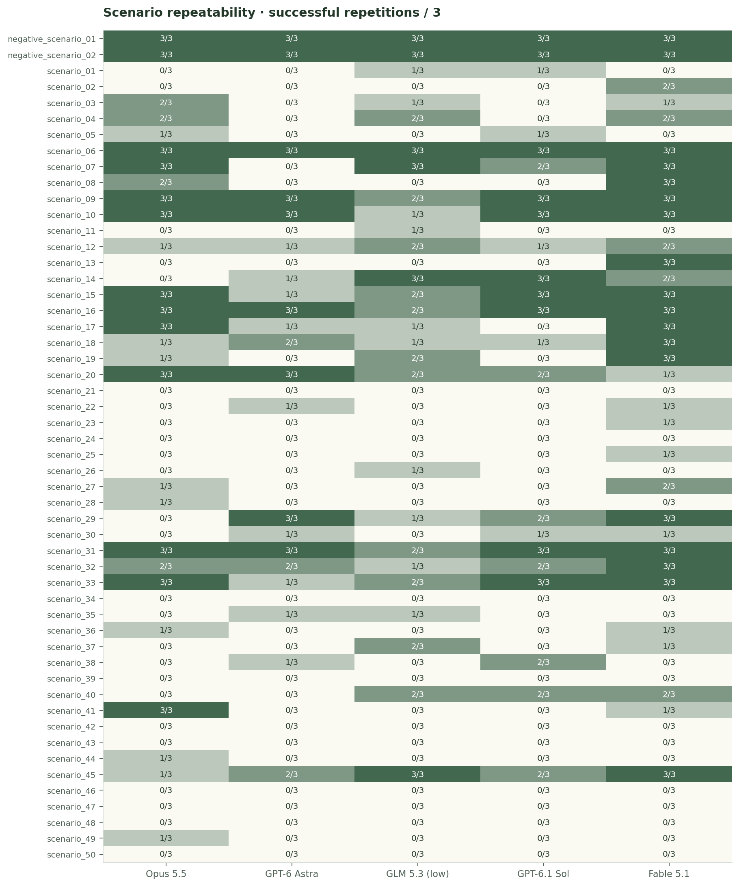

# Transformer · k = 3

[Offline HTML](comparison.html) · [Individual results](cases.csv) · [Criterion averages](criterion-averages.csv) · [Scenario averages](scenario-averages.csv) · [Summary JSON](summary.json) · [Experiment](experiment.json) · [Original repetition](../2026-09-30-transformer/README.md)

The original k = 1 comparison was repeated twice on the **same 52 open-form scenarios** and the **same initial database snapshot**. Each repetition executes all five models; completed answers are graded in a fresh independent Fable 5.1 session, including Fable's own execution. This produces **156 assigned trials per model, 780 overall**, with **779 independent judgments**, **1 terminal execution failure**, and 792 retained invocation attempts.

## Average criterion scores

The [latest AssetOpsBench paper, Sections 5.1–5.3](https://arxiv.org/html/2506.03828v4#S5) reports task completion, data retrieval accuracy and result verification separately. These averages expose the same three criterion names from our existing six-criterion Fable 5.1 judgments. Each criterion is averaged over observed True/False judgments (True = 1, False = 0) within a repetition, then the three repetition averages receive equal weight. Values show **mean ± sample SD in percentage points**; the strict overall pass gate does not affect these averages.

| Model | Task completion (%) | Data retrieval accuracy (%) | Result verification (%) | Judged / assigned |
|---|---:|---:|---:|---:|
| Opus 5.5 | 57.7 ± 5.1 | 96.2 ± 1.9 | 68.6 ± 6.8 | 156/156 |
| GPT-6 Astra | 54.5 ± 2.9 | 90.4 ± 0.0 | 62.8 ± 4.4 | 156/156 |
| GLM 5.3 (low) | 58.1 ± 5.8 | 93.6 ± 4.4 | 55.5 ± 9.6 | 155/156 |
| GPT-6.1 Sol | 51.9 ± 1.9 | 96.2 ± 1.9 | 59.6 ± 1.9 | 156/156 |
| Fable 5.1 | 64.7 ± 7.8 | 99.4 ± 1.1 | 76.3 ± 2.9 | 156/156 |



These runs use **one successful Fable judgment per execution and three execution repetitions**. The paper uses Llama-4-Maverick and averages five judgments of each trajectory, so this is a reporting comparison rather than a reproduction of its judge protocol. GLM has 52/51/52 observed judgments; its terminal execution failure has no criterion judgments and is excluded from these criterion averages. Metric-specific counts and unrounded means/SDs on the 0–1 scale are in [criterion-averages.csv](criterion-averages.csv); per-repetition rates and pooled rates remain in `summary.json`. The overall pass rates below retain the existing six-criterion gate and all assigned trials.

## Overall pass rates



| Model | R1 | R2 | R3 | Median pass | Mean pass ± SD (%) | Mean score ± SD | Median exec ± SD (s) | p95 exec ± SD (s) | Mean tools ± SD | Judged R1/R2/R3 |
|---|---:|---:|---:|---:|---:|---:|---:|---:|---:|---:|
| Opus 5.5 | 30.8% | 46.2% | 32.7% | 32.7% | 36.5 ± 8.4 | 0.717 ± 0.047 | 34.4 ± 1.0 | 60.7 ± 7.4 | 6.0 ± 0.4 | 52/52/52 |
| GPT-6 Astra | 23.1% | 30.8% | 26.9% | 26.9% | 26.9 ± 3.8 | 0.664 ± 0.016 | 40.5 ± 1.2 | 72.1 ± 6.7 | 4.5 ± 0.2 | 52/52/52 |
| GLM 5.3 (low) | 28.8% | 30.8% | 36.5% | 30.8% | 32.1 ± 4.0 | 0.634 ± 0.050 | 32.8 ± 1.7 | 95.6 ± 14.7 | 8.3 ± 0.7 | 52/51/52 |
| GPT-6.1 Sol | 28.8% | 30.8% | 34.6% | 30.8% | 31.4 ± 2.9 | 0.669 ± 0.015 | 43.6 ± 2.1 | 70.4 ± 1.8 | 4.5 ± 0.2 | 52/52/52 |
| Fable 5.1 | 51.9% | 42.3% | 50.0% | 50.0% | 48.1 ± 5.1 | 0.774 ± 0.019 | 56.1 ± 2.5 | 118.6 ± 16.2 | 8.5 ± 0.4 | 52/52/52 |

## Execution time



Timing surrounds the entire agent invocation; grading is measured separately. Each repetition's median and nearest-rank p95 use completed scenario invocations, with observed counts retained in JSON. The table averages those **three repetition statistics**; it does not relabel the pooled median as an average median. Retry-inclusive total execution time includes every measured invocation, including failures. The interactive HTML also shows the pooled execution distribution and a separate repetition table.

## Rubric and resource use





| Model | Input tokens / repeat ± SD | Output tokens / repeat ± SD | Reported reasoning / repeat ± SD | Run error rate ± SD (%) | Tool error rate ± SD (%) | Retry-inclusive exec / repeat ± SD (min) |
|---|---:|---:|---:|---:|---:|---:|
| Opus 5.5 | 10,075,135.3 ± 950,738.8 | 147,110.3 ± 7,390.3 | — | 0.0 ± 0.0 | 22.8 ± 2.0 | 29.6 ± 1.4 |
| GPT-6 Astra | 6,057,425.7 ± 74,684.9 | 44,530.3 ± 136.2 | — | 0.0 ± 0.0 | 13.1 ± 1.1 | 38.9 ± 0.2 |
| GLM 5.3 (low) | 9,035,442.0 ± 630,973.4 | 110,412.0 ± 12,417.7 | 55,474.7 ± 13,551.3 | 7.7 ± 2.5 | 33.7 ± 2.3 | 43.9 ± 5.1 |
| GPT-6.1 Sol | 5,692,130.3 ± 159,413.8 | 40,075.7 ± 761.5 | — | 0.0 ± 0.0 | 13.0 ± 0.6 | 38.4 ± 1.6 |
| Fable 5.1 | 9,971,090.0 ± 389,673.2 | 230,473.0 ± 6,704.3 | — | 0.0 ± 0.0 | 26.7 ± 1.4 | 53.4 ± 1.3 |

Token totals and mean tools use the latest attempt per scenario, including reported metrics from terminal failures. Reliability and total execution time retain every failed/retried attempt; a retry is not a new independent repetition. Token availability and observed denominators are stored in JSON. Missing values remain `null` or empty CSV cells. Costs remain separated into actual billed values and provider estimates in the raw measurements.

## Scenario repeatability



Each cell reports successful repetitions out of three for one scenario/model pair. These are repeated-trial pass frequencies and ordinary mean pass rates; **no “any one of three passed” metric is substituted for the average**.

## Method and evidence

Means give each finished repetition equal weight. The HTML's main cards and pass-rate plot show the **median of the three repetition pass rates**; counts and the outcome bar retain all assigned trials. The repetition table and exported graphs retain means and sample SD. Pass rates use all 52 assigned cases per repetition; an execution that exhausts its three-attempt budget is a known nonpassing outcome. Its judge score, rationale and rubric results remain unavailable, not invented as zeros or false rubric findings. Scores and rubric rates use actual judgments, with availability shown above and in JSON. Whiskers and ± values show **sample standard deviation across repetitions**, not a confidence interval or a significance claim. Missing metrics are excluded with observed counts retained. The no-hallucinations column inverts the adverse raw `hallucinations` finding.

Repetitions 2 and 3 run serially, with five execution targets in parallel within each repetition and independent grading workers alongside them. Fresh per-model namespaces start from the preserved repetition-1 snapshot. State persists across scenario order within each model/repetition, with no per-scenario reset. Scenario and snapshot hashes, exact model IDs, runtime versions, reasoning, limits and judge settings are checked before averaging; per-repetition settings and timestamps are retained.

The original environment limitations still apply: FMSR's default Watsonx backend was unavailable, and the judge uses the existing 8,000-character trajectory cap. Different native harnesses are used for Claude, Codex and GLM; GLM uses low reasoning. Fable judging itself uses an independent session, which does not remove potential same-model preference bias. See the [original method](../2026-09-30-transformer/README.md) for the full rubric and environment policy.

Original repetition-1 evidence is referenced without duplicating it. `repetition-2/` and `repetition-3/` include every retained measurement, successful evaluator trajectory, model/environment settings and compressed full observed execution/judge trace. Trace paths in the HTML are relative to this folder. Credentials and local path prefixes are removed for publication. The suite JSON bytes are unchanged. `summary.json` provides repetition summaries, equal-weight means/SDs, pooled summaries and per-scenario outcomes. `checksums.sha256` covers this folder.

Rebuild this report without model calls:

```bash
uv run tools/publish_repeated_comparison.py \
  --experiment benchmarks/runs/2026-09-30-transformer-k3/experiment.json \
  --output-dir benchmarks/runs/2026-09-30-transformer-k3
```

Start two additional repetitions from the original baseline:

```bash
PYTHONPATH=src .venv/bin/python tools/run_repeated_comparison.py \
  --output-dir generated/comparisons/transformer-k3-new
```
