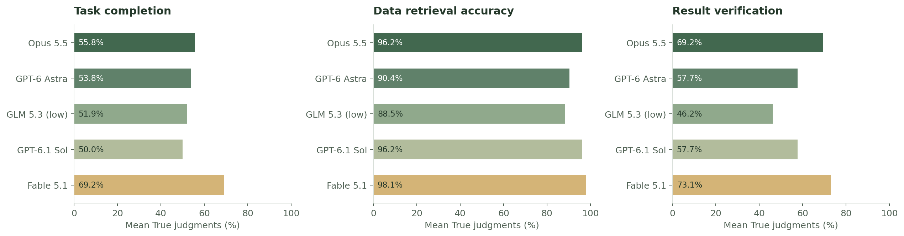
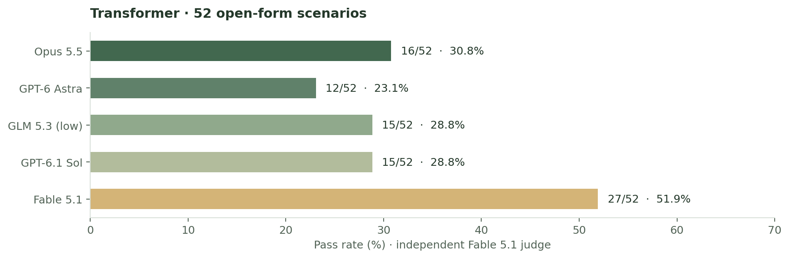
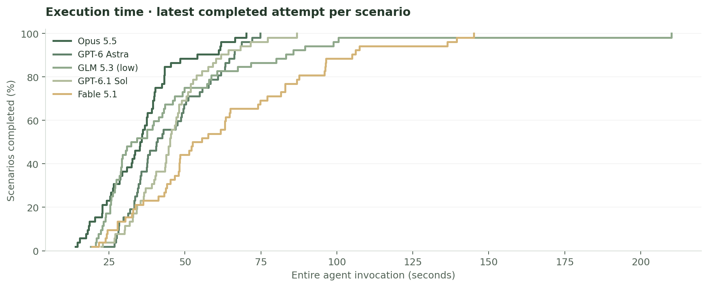
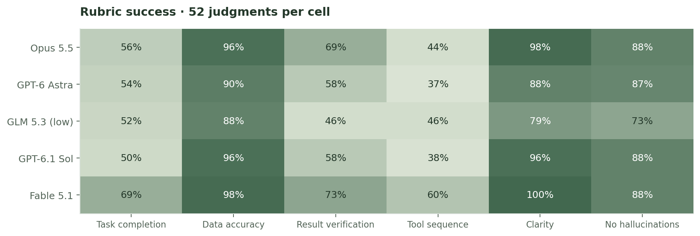
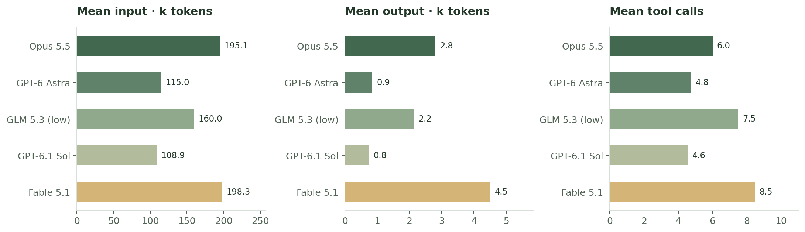
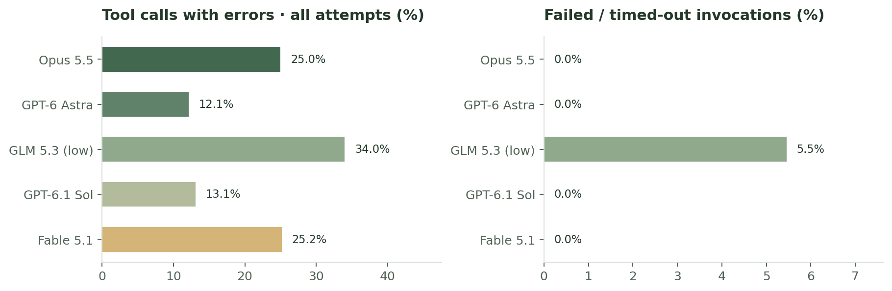

# Transformer comparison · 2026-09-30

[Offline HTML](comparison.html) · [Per-scenario CSV](cases.csv) · [Criterion averages](criterion-averages.csv) · [Summary JSON](summary.json) · [Run manifest](manifest.json)

Five models completed the same **52 scenarios** (50 positive, 2 negative), with **260 independent Fable 5.1 judgments**. Opus 5.5 generated the suite in open form using Semantic Scholar research; the model chose the positive distribution: 9 IoT, 11 FMSR, 6 TSFM, 7 work-order and 17 multiagent scenarios.

## Average criterion scores

The [latest AssetOpsBench paper, Sections 5.1–5.3](https://arxiv.org/html/2506.03828v4#S5) reports task completion, data retrieval accuracy and result verification separately. Below, each is the average of its 52 observed True/False judgments (True = 1, False = 0), expressed as a percentage. The strict overall pass gate does not affect these averages.

| Model | Task completion (%) | Data retrieval accuracy (%) | Result verification (%) | Judged / assigned |
|---|---:|---:|---:|---:|
| Opus 5.5 | 55.8 | 96.2 | 69.2 | 52/52 |
| GPT-6 Astra | 53.8 | 90.4 | 57.7 | 52/52 |
| GLM 5.3 (low) | 51.9 | 88.5 | 46.2 | 52/52 |
| GPT-6.1 Sol | 50.0 | 96.2 | 57.7 | 52/52 |
| Fable 5.1 | 69.2 | 98.1 | 73.1 | 52/52 |



These values come from the existing six-criterion **Fable 5.1** judgments, with one successful judgment per execution. The paper uses Llama-4-Maverick and averages five judgments per trajectory, so this is a reporting comparison rather than a reproduction of its judge protocol. [criterion-averages.csv](criterion-averages.csv) preserves unrounded averages on the 0–1 scale and metric-specific observed counts. The overall pass rates below retain the existing six-criterion gate.

## Overall pass rates



| Model | Passes | Pass rate | Mean score | Median exec (s) | p95 exec (s) | Median grade (s) | Mean tools | Failed attempts |
|---|---:|---:|---:|---:|---:|---:|---:|---:|
| Opus 5.5 | 16/52 | 30.8% | 0.704 | 35.5 | 61.8 | 17.5 | 6.0 | 0/52 (0.0%) |
| GPT-6 Astra | 12/52 | 23.1% | 0.646 | 40.8 | 68.6 | 17.8 | 4.8 | 0/52 (0.0%) |
| GLM 5.3 (low) | 15/52 | 28.8% | 0.581 | 33.2 | 98.8 | 16.2 | 7.5 | 3/55 (5.5%) |
| GPT-6.1 Sol | 15/52 | 28.8% | 0.654 | 45.1 | 71.5 | 16.3 | 4.6 | 0/52 (0.0%) |
| Fable 5.1 | 27/52 | 51.9% | 0.777 | 54.0 | 136.3 | 17.9 | 8.5 | 0/52 (0.0%) |

## Timing and aggregation



Execution timing surrounds the **entire agent invocation**, including process/SDK startup, MCP setup, model and tool work, answer persistence, cleanup and exit. Grading is timed separately. The first-response metric is the first observed assistant/protocol response, not first-token latency. Request-level timing is available for GLM; Claude and Codex do not expose every underlying request boundary.

Pass rates, score, rubric rates, resource means and the execution distribution use the latest completed attempt for each scenario: 52 observations per model. p95 uses the nearest-rank method. Reliability uses **all 263 retained attempts**: three GLM attempts hit the 30-turn limit and subsequently succeeded on retry. `summary.json` keeps case and attempt aggregates separately, including total invocation time across retries. These sums exclude scheduling gaps and are not elapsed suite time. Excluded obsolete results and invalid infrastructure runs are not part of this publication.

Retained execution/judgment window (UTC): `2026-09-30T20:31:08.050701+00:00` through `2026-09-30T21:27:20.886350+00:00`. Execution targets ran concurrently, with configured concurrency 5 and serial suite order within each target. Independent grading workers ran alongside execution. Actual overlap varied, including a resumed GLM phase; timestamps preserve the observed order.

## Rubric



The existing AssetOpsBench LLM judge checks task completion, data accuracy, result verification, tool sequence, clarity and hallucinations against each generated characteristic answer. A pass requires all five positive criteria and no hallucinations. Score is the fraction of the first five criteria satisfied, with a 0.2 hallucination penalty. The last heatmap column means **no hallucinations**; raw CSV/JSON `hallucinations=true` means the adverse finding.

Judge: `claude-code/claude-fable-5-1`, Claude CLI 2.1.286. Each judgment used a fresh, tool-free session independent of the executor; all 260 successful judge session IDs are distinct. Fable execution was judged by the same model in a separate session, as requested. The existing evaluator caps trajectory evidence at **8,000 characters**; final answer and characteristic behavior are provided separately. Full untruncated observed execution and judge traces are included. Independent sessions do not eliminate same-model preference bias.

## Tokens and tools



| Model | Input tokens | Output tokens | Reasoning tokens | Cache read | Cache write |
|---|---:|---:|---:|---:|---:|
| Opus 5.5 | 10,142,645 | 146,167 | — | 9,727,749 | 414,396 |
| GPT-6 Astra | 5,982,014 | 44,385 | — | 4,599,296 | — |
| GLM 5.3 (low) | 8,317,620 | 111,845 | 58,655 | 8,132,672 | — |
| GPT-6.1 Sol | 5,664,362 | 39,298 | — | 4,323,712 | — |
| Fable 5.1 | 10,309,411 | 234,420 | — | 9,736,388 | 566,711 |

Totals above cover the latest 52 execution attempts, excluding judging. Input includes provider-reported cached input; output uses provider totals. Reasoning and cache subdivisions remain missing when the runtime does not report them. JSON uses `null`, CSV uses empty cells, and tables use “—” for unavailable values. Availability denominators and retry-inclusive totals are in `summary.json`. Actual billed costs are unavailable; CLI estimates are retained separately in each measurement and must not be treated as subscription charges.



Tool errors include explicit MCP errors and benchmark error payloads. The error fraction uses all retained tool calls, including failed invocation attempts. Timeout and internal retry counts remain missing where they cannot be reliably distinguished. Repeated identical calls are recorded separately and are not assumed to be retries. Database auditing records actual attempted/succeeded writes and created/changed record IDs in the measurement ledger.

## Environment and limits

| Model ID | Provider / harness | CLI / SDK | Reasoning | Invocation timeout | Turn cap |
|---|---|---|---|---:|---:|
| `claude-opus-5-5` | Anthropic / Claude Agent SDK | CLI 2.1.286 / SDK 0.1.56 | Provider default, not reported | 900 s | 30 |
| `gpt-6-astra` | OpenAI / Codex CLI subscription | CLI 0.159.0 | Provider default, not reported | 900 s (inner CLI 840 s) | Not exposed |
| `zai/glm-5.3` | z.ai / OpenAI Agents SDK | SDK 0.13.6 | low | 900 s | 30 |
| `gpt-6.1-sol` | OpenAI / Codex CLI subscription | CLI 0.159.0 | Provider default, not reported | 900 s (inner CLI 840 s) | Not exposed |
| `claude-fable-5-1` | Anthropic / Claude Agent SDK | CLI 2.1.286 / SDK 0.1.56 | Provider default, not reported | 900 s | 30 |

Execution temperature and output-token caps were not explicitly set; unknown effective defaults are missing. Generation requests use a 131,072-token ceiling clipped to the known model output limit; CLI runtimes do not expose a controllable effective token cap. GLM's provider SDK allows two internal retries; whole-invocation retries are bounded at three in the current runner. Grading allows three attempts on backend/parse failure. Historical per-record settings are preserved, including fields introduced during the run; absence is not backfilled.

All targets started from the same database snapshot: **12 databases, 14,416 documents**. Each model had an isolated namespace; state persisted across scenarios in suite order with **no per-scenario reset**. Partial writes from retries also persist. The raw starting database snapshot is not bundled; its hash and policy are recorded, so rebuilding these charts is reproducible from the published evidence, while rerunning models requires an equivalent database environment.

**Shared tool limitation:** FMSR LLM-dependent tools returned “LLM unavailable” because their default Watsonx model (`watsonx/meta-llama/llama-3-3-70b-instruct`) was not configured. This affected DGA interpretation and related workflows for all models. The grader still applies the original expected tool behavior. These scores compare the recorded model/harness combinations in this environment; they are not an isolated model-ability ranking.

- Suite SHA-256: `aeba796f98ad8c1f75d9aaf0dab5acc599fed1fc592fdc81cf2d3064dc2390d4`
- Rubric SHA-256: `43088a0fff281b3ddb2bca0b4f1c5abb31e02ce90ac4d4d2645b6df72d345bdc`
- Initial database snapshot SHA-256: `b6b1c09cada7b204dcda76e110a1fe2f11478abc911493500d2c757a6905a58a`

## Evidence and reproduction

`suite/` contains the exact scenario files, generation manifest and research/generation evidence. `models/<target>/settings.json` records model/provider/runtime versions and limits; `environment.json` records the snapshot/reset policy. `measurements/` contains every retained attempt, outcome, rubric, rationale, timestamps, token/tool metrics, database audit and cost availability. `trajectories/` contains successful evaluator inputs. `events/*.jsonl.gz` contains full observed execution messages, tool arguments/outputs/errors and judge inputs/results. Trace references are relative to this run folder. Credential values and local path prefixes are removed during publication; measured numbers and timestamps are preserved.

Open `comparison.html` locally for the self-contained interactive comparison. GitHub's file view does not execute HTML; download it or serve it locally. Static graphs above are also available as SVG for export. `checksums.sha256` covers published evidence and artifacts.

Rebuild the graphs, CSV, summary, README and checksums without invoking any model:

```bash
uv run benchmarks/runs/2026-09-30-transformer/publish.py
```

Launch a new five-model run against the published suite after configuring the model authentication and CouchDB environment:

```bash
# The configuration points to the committed transformer suite.
PYTHONPATH=src .venv/bin/python tools/run_generated_comparison.py \
  --output-dir generated/comparisons/transformer-new
```

See [runner setup](../../generated-scenarios.md) for authentication, isolation and live grading. No model calls are made by this publication script. The implementation commit at publication is recorded in `manifest.json`; this is a code reference, not a claim that the runs originally executed from a clean committed tree.
