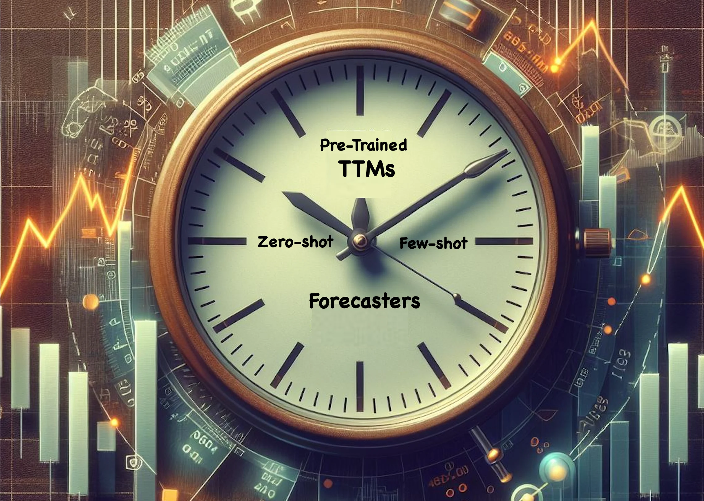
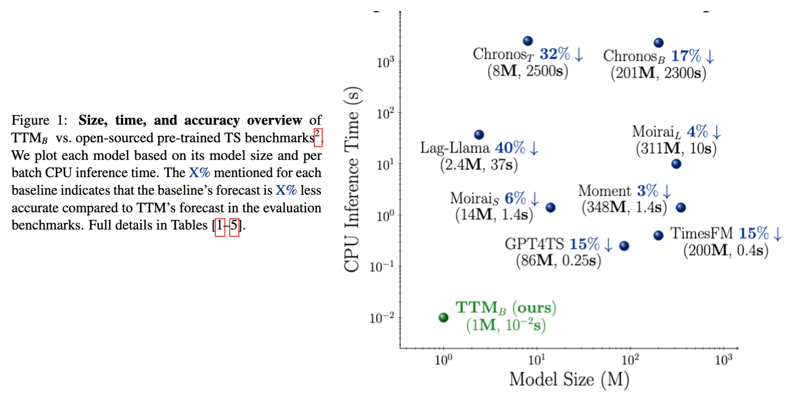

# Granite-TimeSeries-TTM-R2 Model Card

<p align="center" width="100%">

</p>

TinyTimeMixers (TTMs) are compact pre-trained models for Multivariate Time-Series Forecasting, open-sourced by IBM Research. 
**With model sizes starting from 1M params, TTM introduces the notion of the first-ever “tiny” pre-trained models for Time-Series Forecasting. The paper describing TTM was accepted at [NeurIPS 24](https://proceedings.neurips.cc/paper_files/paper/2024/hash/874a4d89f2d04b4bcf9a2c19545cf040-Abstract-Conference.html).** 


TTM outperforms other models demanding billions of parameters in several popular zero-shot and few-shot forecasting benchmarks. TTMs are lightweight 
forecasters, pre-trained on publicly available time series data with various augmentations. TTM provides state-of-the-art zero-shot forecasts and can easily be 
fine-tuned for multi-variate forecasts with just 5% of the training data to be competitive. **Note that zeroshot, fine-tuning and inference tasks using TTM can easily be executed on 1 GPU or on laptops.** 

TTM r2 comprises TTM variants pre-trained on larger pretraining datasets (\~700M samples). The TTM r2.1 release increases the pretraining dataset size to approximately (\~1B samples). The prior model releases, TTM r1, were trained on \~250M samples and can be accessed [here](https://huggingface.co/ibm-granite/granite-timeseries-ttm-r1). In general, TTM r2 models perform better than TTM r1 models as they are 
trained on a larger pretraining dataset. In standard benchmarks, TTM r2 outperform TTM r1 by over 15%.  However, the choice of r1 vs. r2 depends on your target data distribution, and hence users should try both variants and pick the best model for your data.
The TTM r2 releases support point forecasting use-cases specifically ranging from minutely to hourly resolutions 
(Ex. 10 min, 15 min, 1 hour.). With the TTM r2.1 release, we add support for daily and weekly resolutions.


### Links

- **Paper:** [NeurIPS 2024](https://proceedings.neurips.cc/paper_files/paper/2024/hash/874a4d89f2d04b4bcf9a2c19545cf040-Abstract-Conference.html), [ArXiV](https://arxiv.org/pdf/2401.03955.pdf)
- **Repository:** https://github.com/ibm-granite/granite-tsfm
- **PyPI project:** https://pypi.org/project/granite-tsfm/
- **Model architecture:** https://github.com/ibm-granite/granite-tsfm/tree/main/tsfm_public/models/tinytimemixer
- **Time Series Cookbook:** https://github.com/ibm-granite-community/granite-timeseries-cookbook


## Model Description

TTM falls under the category of “focused pre-trained models”, wherein each pre-trained TTM is tailored for a particular forecasting 
setting (governed by the context length and forecast length). Instead of building one massive model supporting all forecasting settings, 
we opt for the approach of constructing smaller pre-trained models, each focusing on a specific forecasting setting, thereby 
yielding more accurate results. Furthermore, this approach ensures that our models remain extremely small and exceptionally fast, 
facilitating easy deployment without demanding a ton of resources. 

Hence, in this model card, we release several pre-trained TTMs that can cater to many common forecasting settings in practice. 
Each pre-trained model will be released in a different branch name in this model card. Given the variety of models included, we recommend the use of [`get_model()`](https://github.com/ibm-granite/granite-tsfm/blob/main/tsfm_public/toolkit/get_model.py) utility to automatically select the required model based on your input context length, and forecast length, and other requirements. You can also directly access a specific model using our 
getting started [notebook](https://github.com/IBM/tsfm/blob/main/notebooks/hfdemo/ttm_getting_started.ipynb) mentioning the branch name.


## Model Releases

There are several models available in different branches of this model card. The naming scheme follows the following format:
`<context length>-<prediction length>-<frequency prefix tuning indicator>-<pretraining metric>-<release number>`

 - context length: The historical data used as input to the TTM model.

 - prediction length: The number of time points predicted by model (i.e., the forecast length)

 - frequency tuning indicator ("ft" or missing): "ft" is used to indicate use of frequency prefix tuning. When enabled an extra embedding vector indicating the frequency of the data is added to the input of the model. If missing, only the context window is used by the model.

 - pretraining metric ("mae" or missing): MAE indicates pertaining with mean absolute error loss, while missing indicates using mean squared error.

 - release number ("r2" or "r2.1"): Indicates the model release; the release indicates which data was used to train the model. See "training data" below for more details on the data included in the particular training datasets.  


### Example recipes and notebooks
The scripts below can be used for any of the above TTM models. Please update the HF model URL and branch name in the `from_pretrained` call appropriately to pick the model of your choice. Please note that a few of the notebooks directly use the [`get_model()`](https://github.com/ibm-granite/granite-tsfm/blob/main/tsfm_public/toolkit/get_model.py) utility to select the model.

- Getting started [[Recipe]](https://github.com/ibm-granite-community/granite-timeseries-cookbook/blob/main/recipes/Time_Series/Time_Series_Getting_Started.ipynb) [[colab]](https://colab.research.google.com/github/ibm-granite/granite-tsfm/blob/main/notebooks/hfdemo/ttm_getting_started.ipynb) 
- Getting started with IBM watsonx [[Recipe]](https://github.com/ibm-granite-community/granite-timeseries-cookbook/blob/main/recipes/Time_Series/Getting_Started_with_WatsonX_AI_SDK.ipynb)
- Zeroshot Multivariate Forecasting [[Example]](https://github.com/ibm-granite/granite-tsfm/blob/main/notebooks/hfdemo/ttm_getting_started.ipynb)
- Finetuned Multivariate Forecasting:
  - Channel-Independent Finetuning [[Example 1]](https://github.com/ibm-granite/granite-tsfm/blob/main/notebooks/hfdemo/ttm_getting_started.ipynb) [[Example 2]](https://github.com/ibm-granite/granite-tsfm/blob/main/notebooks/hfdemo/tinytimemixer/ttm_m4_hourly.ipynb)
  - Channel-Mix Finetuning [[Example]](https://github.com/ibm-granite/granite-tsfm/blob/main/notebooks/tutorial/ttm_channel_mix_finetuning.ipynb)
- TTM r2 release (extended features released on October 2024):
  - Finetuning and Forecasting with Exogenous/Control Variables [[Recipe 1]](https://github.com/ibm-granite-community/granite-timeseries-cookbook/blob/main/recipes/Time_Series/Few-shot_Finetuning_and_Evaluation.ipynb) [[Recipe 2]](https://github.com/ibm-granite-community/granite-timeseries-cookbook/blob/main/recipes/Time_Series/Bike_Sharing_Finetuning_with_Exogenous.ipynb)
  - Finetuning and Forecasting with static categorical features [Example: To be added soon]
  - Rolling Forecasts - Extend forecast lengths via rolling capability. Rolling beyond 2*forecast_length is not recommended. [[Example]](https://github.com/ibm-granite/granite-tsfm/blob/main/notebooks/hfdemo/ttm_rolling_prediction_getting_started.ipynb)
  - Helper scripts for optimal Learning Rate suggestions for Finetuning [[Example]](https://github.com/ibm-granite/granite-tsfm/blob/main/notebooks/tutorial/ttm_with_exog_tutorial.ipynb)
- TTM r2.1 release:
  - GIFT-Eval benchmark [[notebook]](https://github.com/SalesforceAIResearch/gift-eval/blob/main/notebooks/ttm.ipynb)


### Usage guidelines
1. Users have to externally standard scale their data independently for every channel before feeding it to the model (refer to [`TimeSeriesPreprocessor`](https://github.com/IBM/tsfm/blob/main/tsfm_public/toolkit/time_series_preprocessor.py), our data processing utility for data scaling).
2. The current open-source version supports only minutely and hourly resolutions(Ex. 10 min, 15 min, 1 hour.). Other lower resolutions (say monthly or yearly) are currently not supported in this version, as the model needs a minimum context length of 512 or 1024. With the r2.1 release, we now also support daily and weekly resolution.
3. Enabling any upsampling or prepending zeros to virtually increase the context length for shorter-length datasets is not recommended and will impact the model performance. 


### Automatic model selection
Automatic model selection based on context length, prediction length, and other requirements can be done through use of the `get_model()` function. For reference, the signature of the function is provided below:
```
def get_model(
    model_path: str,
    model_name: str = "ttm",
    context_length: Optional[int] = None,
    prediction_length: Optional[int] = None,
    freq_prefix_tuning: bool = False,
    freq: Optional[str] = None,
    prefer_l1_loss: bool = False,
    prefer_longer_context: bool = True,
    force_return: Optional[str] = None,
    return_model_key: bool = False,
    **kwargs,
) -> Union[str, PreTrainedModel]:
    """TTM Model card offers a suite of models with varying `context_length` and `prediction_length` combinations.
    This wrapper automatically selects the right model based on the given input `context_length` and
    `prediction_length` abstracting away the internal complexity.

    Args:
        model_path (str): HuggingFace model card path or local model path (Ex. ibm-granite/granite-timeseries-ttm-r2)
        model_name (str, optional): Model name to use. Current allowed values: [ttm]. Defaults to "ttm".
        context_length (int, optional): Input Context length or history. Defaults to None.
        prediction_length (int, optional): Length of the forecast horizon. Defaults to None.
        freq_prefix_tuning (bool, optional): If true, it will prefer TTM models that are trained with frequency prefix
            tuning configuration. Defaults to None.
        freq (str, optional): Resolution or frequency of the data. Defaults to None. Allowed values are as
            per the `DEFAULT_FREQUENCY_MAPPING`.
        prefer_l1_loss (bool, optional): If True, it will prefer choosing models that were trained with L1 loss or
            mean absolute error loss. Defaults to False.
        prefer_longer_context (bool, optional): If True, it will prefer selecting model with longer context/history
            Defaults to True.
        force_return (str, optional): This is used to force the get_model() to return a TTM model even when the provided
            configurations don't match with the existing TTMs. It gets the closest TTM possible. Allowed values are
            ["zeropad"/"rolling"/"random_init_small"/"random_init_medium"/"random_init_large"/`None`].
            "zeropad" = Returns a pre-trained TTM that has a context length higher than the input context length, hence,
            the user must apply zero-padding to use the returned model.
            "rolling" = Returns a pre-trained TTM that has a prediction length lower than the requested prediction length,
            hence, the user must apply rolling technique to use the returned model to forecast to the desired length.
            The `RecursivePredictor` class can be utilized in this scenario.
            "random_init_small" = Returns a randomly initialized small TTM which must be trained before performing inference.
            "random_init_medium" = Returns a randomly initialized medium TTM which must be trained before performing inference.
            "random_init_large" = Returns a randomly initialized large TTM which must be trained before performing inference.
            `None` = `force_return` is disable. Raises an error if no suitable model is found.
            Defaults to None.
        return_model_key (bool, optional): If True, only the TTM model name will be returned, instead of the actual model.
            This does not downlaod the model, and only returns the name of the suitable model. Defaults to False.

    Returns:
        Union[str, PreTrainedModel]: Returns the Model, or the model name.
    """
```


    
## Benchmarks

<p align="center" width="100%">

</p>

TTM outperforms popular benchmarks such as TimesFM, Moirai, Chronos, Lag-Llama, Moment, GPT4TS, TimeLLM, LLMTime in zero/fewshot forecasting while reducing computational requirements significantly. 
Moreover, TTMs are lightweight and can be executed even on CPU-only machines, enhancing usability and fostering wider
adoption in resource-constrained environments. For more details, refer to our [paper](https://arxiv.org/pdf/2401.03955.pdf).
- TTM-B referred in the paper maps to the 512 context models.
- TTM-E referred in the paper maps to the 1024 context models.
- TTM-A referred in the paper maps to the 1536 context models.

The pre-training dataset used in this release differs slightly from the one used in the research
paper, which may lead to minor variations in model performance as compared to the published results. Please refer to our paper for more details. Benchmarking scripts can be found [here](https://github.com/ibm-granite/granite-tsfm/tree/main/notebooks/hfdemo/tinytimemixer/full_benchmarking).


## Model Details

For more details on TTM architecture and benchmarks, refer to our [paper](https://arxiv.org/pdf/2401.03955.pdf).

TTM currently supports two modes:

 - **Zeroshot forecasting**: Directly apply the pre-trained model on your target data to get an initial forecast (with no training).

 - **Finetuned forecasting**: Finetune the pre-trained model with a subset of your target data to further improve the forecast.

Since, TTM models are extremely small and fast, it is practically very easy to finetune the model with your available target data in few minutes  to get more accurate forecasts.

The current release supports multivariate forecasting via both channel independence and channel-mixing approaches. 
Decoder Channel-Mixing can be enabled during fine-tuning for capturing strong channel-correlation patterns across 
time-series variates, a critical capability lacking in existing counterparts. In addition, TTM also supports exogenous infusion and static categorical data infusion.

The r2.1 release builds upon the above, adding improved accuracy for shorter context length, daily/weekly resolution, combined with a larger pre-training dataset.


## Training Data

The r2 TTM models were trained on a collection of datasets as follows:
 - Australian Electricity Demand: https://zenodo.org/records/4659727 
 - Australian Weather: https://zenodo.org/records/4654822 
 - Bitcoin: https://zenodo.org/records/5122101 
 - KDD Cup 2018: https://zenodo.org/records/4656756 
 - London Smart Meters: https://zenodo.org/records/4656091 
 - Saugeen River Flow: https://zenodo.org/records/4656058
 - Solar Power: https://zenodo.org/records/4656027 
 - Sunspots: https://zenodo.org/records/4654722
 - Solar: https://zenodo.org/records/4656144 
 - US Births: https://zenodo.org/records/4656049 
 - Wind Farms Production: https://zenodo.org/records/4654858 
 - Wind Power: https://zenodo.org/records/4656032
 - PEMSD3, PEMSD4, PEMSD7, PEMSD8, PEMS_BAY: https://drive.google.com/drive/folders/1g5v2Gq1tkOq8XO0HDCZ9nOTtRpB6-gPe
 - LOS_LOOP: https://drive.google.com/drive/folders/1g5v2Gq1tkOq8XO0HDCZ9nOTtRpB6-gPe 

The r2.1 TTM models (denoted by branches with suffix r2.1) were trained on the above collection, in addition to the following datasets:
 - Weather: https://zenodo.org/records/4654822
 - Covid Deaths: https://zenodo.org/records/4656009
 - Covid Mobility: https://zenodo.org/records/4663809
 - Extended Wikipedia Web Traffic: https://zenodo.org/records/7371038
 - NN5: https://zenodo.org/records/4656117, https://zenodo.org/records/4656125
 - Temperature Rain: https://zenodo.org/records/5129091
 - Vehicle Trips: https://zenodo.org/records/5122537
 - Kaggle Web Traffic: https://zenodo.org/records/4656075, https://zenodo.org/records/4656664
 - Hierarchical Sales: https://huggingface.co/datasets/Salesforce/lotsa_data/tree/main/hierarchical_sales
 - Project Tycho: https://huggingface.co/datasets/Salesforce/lotsa_data/tree/main/project_tycho
 - Subseasonal: https://huggingface.co/datasets/Salesforce/lotsa_data/tree/main/subseasonal
 - Subseasonal Precipitation: https://huggingface.co/datasets/Salesforce/lotsa_data/tree/main/subseasonal_precip
 - Uber TLC: https://huggingface.co/datasets/Salesforce/lotsa_data/tree/main/uber_tlc_daily
 - Wiki Rolling: https://github.com/awslabs/gluonts/blob/1553651ca1fca63a16e012b8927bd9ce72b8e79e/datasets/wiki-rolling_nips.tar.gz
 - CDC FluView ILINet: https://huggingface.co/datasets/Salesforce/lotsa_data/tree/main/cdc_fluview_ilinet
 - CDC FluView WHO/NREVSS: https://huggingface.co/datasets/Salesforce/lotsa_data/tree/main/cdc_fluview_who_nrevss


## Citation
Please cite the following paper if you intend to use our model or its associated architectures/approaches in your 
work.

**BibTeX:**

```
@inproceedings{ekambaram2024tinytimemixersttms,
      title={Tiny Time Mixers (TTMs): Fast Pre-trained Models for Enhanced Zero/Few-Shot Forecasting of Multivariate Time Series},
      author={Vijay Ekambaram and Arindam Jati and Pankaj Dayama and Sumanta Mukherjee and Nam H. Nguyen and Wesley M. Gifford and Chandra Reddy and Jayant Kalagnanam},
      booktitle={Advances in Neural Information Processing Systems (NeurIPS 2024)},
      year={2024},
}
```

## Model Card Authors

Vijay Ekambaram, Arindam Jati, Pankaj Dayama, Wesley M. Gifford, Tomoya Sakai, Sumanta Mukherjee, Chandra Reddy and Jayant Kalagnanam


## IBM Public Repository Disclosure

All content in this repository including code has been provided by IBM under the associated 
open source software license and IBM is under no obligation to provide enhancements, 
updates, or support. IBM developers produced this code as an 
open source project (not as an IBM product), and IBM makes no assertions as to 
the level of quality nor security, and will not be maintaining this code going forward.
